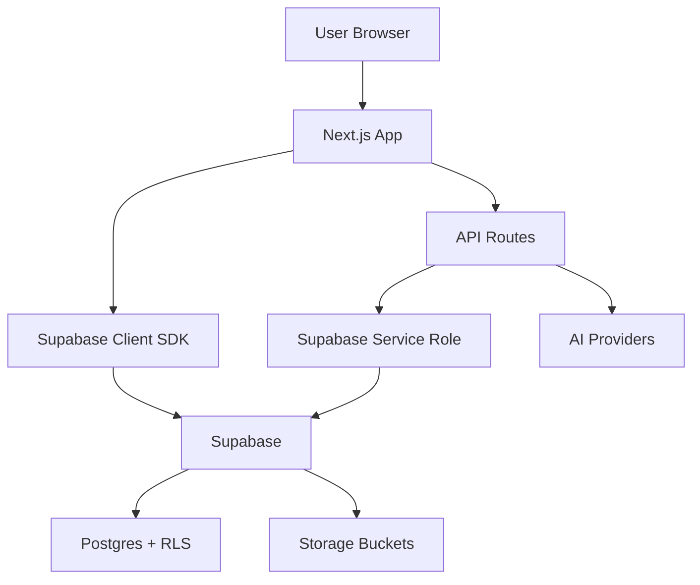

# Mobility Journey 🏋️


A personal dashboard for tracking posture, scoliosis correction, and mobility improvement.

## Features

- 📸 **Photo Timeline** - Upload and compare progress photos (front/back/side views)
- 📊 **Metrics Tracker** - Log Cobb angle, pain levels, flexibility, and more
- 📝 **Analysis Log** - AI insights, personal notes, and specialist feedback
- ✅ **Protocol Tracker** - Daily exercises, appointments, supplements
- 📈 **Progress Charts** - Visualize improvement over time

## Tech Stack

- Next.js 16 (App Router)
- TypeScript
- Tailwind CSS
- Recharts for visualizations
- Lucide React for icons

## Architecture



## Getting Started

```bash
# Install dependencies
bun install

# Run development server
bun dev

# Build for production
bun run build
```

Open [http://localhost:3000](http://localhost:3000) to view the dashboard.

## Project Structure

```
src/
├── app/
│   ├── page.tsx        # Main dashboard page
│   ├── layout.tsx      # Root layout
│   └── globals.css     # Global styles
└── components/
    ├── PhotoTimeline.tsx   # Photo upload and comparison
    ├── MetricsTracker.tsx  # Measurement logging
    ├── AnalysisLog.tsx     # Notes and insights
    ├── TodoTracker.tsx     # Exercise protocol
    └── ProgressCharts.tsx  # Data visualization
```

## Data Storage

Supabase provides storage, auth, and RLS-protected Postgres tables. See `docs/deployment.md` and `docs/security.md` for setup details.

## Deployment

See `docs/deployment.md` for Vercel configuration, Supabase setup, and migration steps.

## Contributing

See `CONTRIBUTING.md` for local setup and workflow guidelines.

## Related

- Project plan: `~/clawd/projects/nick-posture-scoliosis/PROJECT.md`
- Progress log: `~/clawd/projects/nick-posture-scoliosis/PROGRESS.md`

---

Built with 💪 for the journey to better posture.
